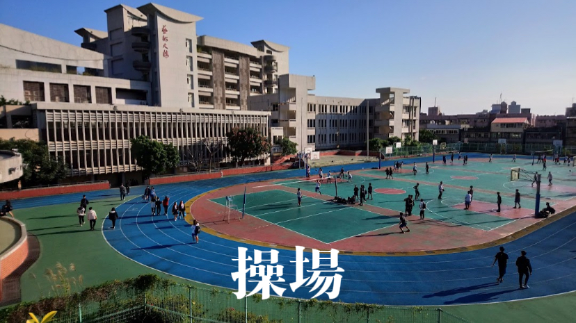

<!doctype html>
<html>
  <head>
    <!-- Required meta tags -->
    <meta charset="utf-8">
    <meta name="viewport" content="width=device-width, initial-scale=1">
    
    <!-- Bootstrap CSS -->
    <link href="https://cdn.jsdelivr.net/npm/bootstrap@5.1.1/dist/css/bootstrap.min.css" rel="stylesheet" integrity="sha384-F3w7mX95PdgyTmZZMECAngseQB83DfGTowi0iMjiWaeVhAn4FJkqJByhZMI3AhiU" crossorigin="anonymous">

    <title>復興高中</title>
  </head>
  <body>
     
    
.bg-secondary
    
<h1><b>復興高中</b></h1>

     
  

.bg-secondary

     
    <h2><b>形象影片</b></h2>
     
    <!-- Optional JavaScript; choose one of the two! -->

    <!-- Option 1: Bootstrap Bundle with Popper -->
    

    <!-- Option 2: Separate Popper and Bootstrap JS -->
    <!--
    
    
    -->
  </body>
  

  <iframe width="660" height="385" src="https://www.youtube.com/embed/XBbWp7VYFD4" title="YouTube video player" frameborder="0" allow="accelerometer; autoplay; clipboard-write; encrypted-media; gyroscope; picture-in-picture" allowfullscreen></iframe>
  <iframe width="660" height="385" src="https://www.youtube.com/embed/Y59Op2HDhbg" title="YouTube video player" frameborder="0" allow="accelerometer; autoplay; clipboard-write; encrypted-media; gyroscope; picture-in-picture" allowfullscreen></iframe>
  

   
   
  

   
  <h2><b>學校場所</b></h2>
   
  

  
  
  
  

   
   
  

  
  
  
  

   

.bg-secondary
   
  <ul class="list-unstyled">
    <li><h5>圖片出處</h5></li>
  </ul>
            <li>https://ocat.pixnet.net/blog/post/3526046</li>
            <li>https://www.doe.gov.taipei/ct.asp?xItem=210893727&ctNode=66155&mp=104001</li>
            <li>//www.flickr.com/photos/teia/15966433327</li>
            <li>https://taipeicatalog.com/places/5727381</li>
            <li>https://lh5.googleusercontent.com/p/AF1QipOYhkYwROW8Lm7gwYNj410jRS-g8s6j2XbDGoVT=w1080-k-no</li>
            <li>https://www.ettoday.net/news/20171104/1045594.htm</li>
            <li>http://www.fhsh.tp.edu.tw/</li>
  
<h1><b><button type="button" class="btn btn-light"><a href="#">home</a></button></b></h1>

      
</html>